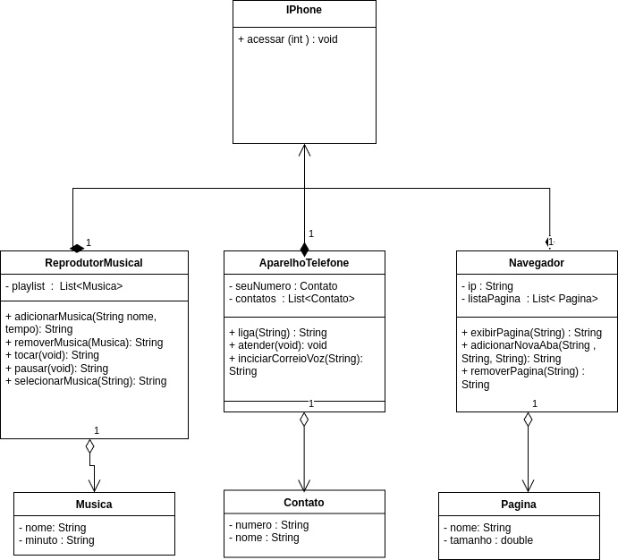

# -Modelando o iPhone com UML: Funções de Músicas, Chamadas e Internet

### Desafio proposto pela #DIO na formação JAVA DEVELOPER.

#### Objetivo: Com base no vídeo de lançamento do iPhone, utilize uma ferramenta de UML de sua preferência para elaborar a diagramação das classes e interfaces, representando as funções do iPhone como Reprodutor Musical, Aparelho Telefônico e Navegador na Internet. Após isso, crie as classes e interfaces no formato de arquivos .java. Desafie-se a reproduzir este projeto em seu próprio repositório Git!

